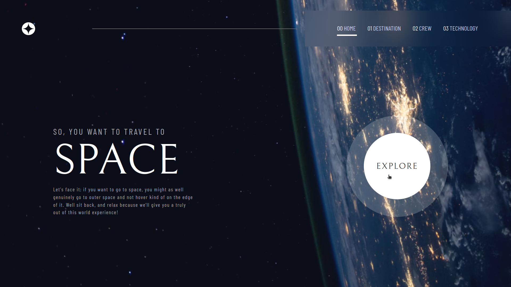
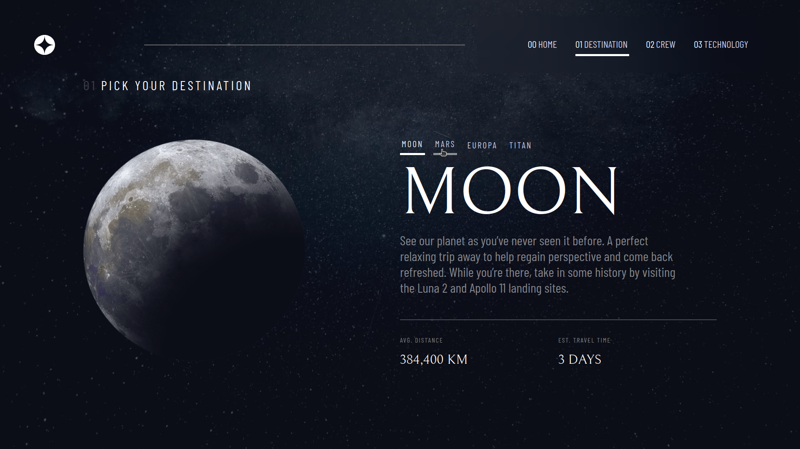
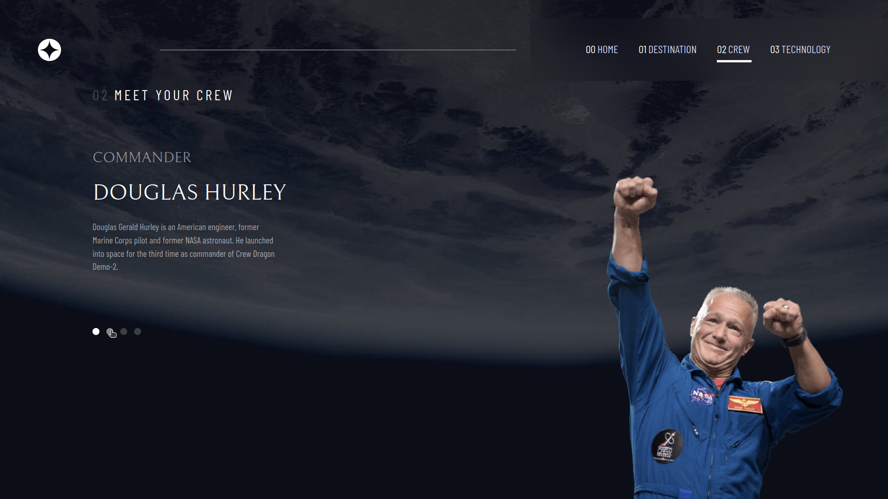
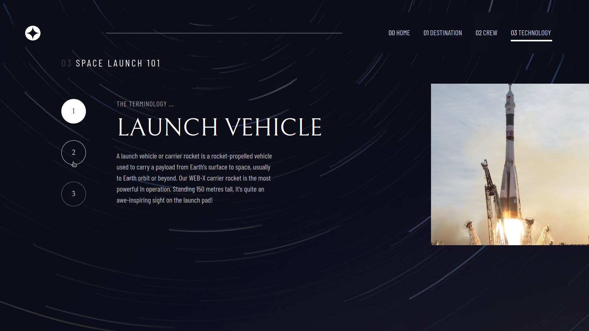

# Frontend Mentor - Space tourism website solution

This is a solution to the [Space tourism website challenge on Frontend Mentor](https://www.frontendmentor.io/challenges/space-tourism-multipage-website-gRWj1URZ3). Frontend Mentor challenges help you improve your coding skills by building realistic projects.

## Table of contents

- [Frontend Mentor - Space tourism website solution](#frontend-mentor---space-tourism-website-solution)
  - [Table of contents](#table-of-contents)
  - [Overview](#overview)
    - [The challenge](#the-challenge)
    - [Screenshot](#screenshot)
    - [Links](#links)
  - [My process](#my-process)
    - [Built with](#built-with)
    - [What I learned](#what-i-learned)
  - [Author](#author)

## Overview

### The challenge

Users should be able to:

- View the optimal layout for each of the website's pages depending on their device's screen size
- See hover states for all interactive elements on the page
- View each page and be able to toggle between the tabs to see new information

### Screenshot

> Homepage
> 

> Destinations
> 

> Crew
> 

> Technology
> 

### Links

- Solution URL: [Github](https://github.com/bhaskrr/react-space-tourism-multi-page-website)
- Live Site URL: [Vercel](https://react-space-tourism-multi-page-website.vercel.app/)

## My process

### Built with

- Semantic HTML5 markup
- CSS custom properties
- Flexbox
- Mobile-first workflow
- [React](https://reactjs.org/) - JS library

### What I learned

```css
/* The code below was used to add the hover effect to the explore button on homepage: */

.explore-btn::after {
  content: "";
  position: absolute;
  inset: calc(-2px);
  /* Inset with negative value to create space */
  border-radius: 50%;
  /*Ensures a circular shape*/
  background-color: transparent;
  /*Initially transparent*/
  transition: all 0.3s ease;
  /* Transition for size and color */
}

.explore-btn:hover {
  &::after {
    background-color: rgba(255, 255, 255, 0.2);
    /* White color for expanding border */
    transform: scale(1.5);
    /* Increase size of pseudo-element */
  }
}
```

```js
// The following code was used to render the optimal background image for the app based on screen size:

const appBackground = {
  backgroundImage:
    homepageView && window.innerWidth > 768
      ? `url(${homeDesktop})`
      : homepageView && window.innerWidth <= 375
      ? `url(${homeMobile})`
      : homepageView && window.innerWidth <= 768
      ? `url(${homeTablet})`
      : destinationpageView && window.innerWidth > 768
      ? `url(${destinationDesktop})`
      : destinationpageView && window.innerWidth <= 375
      ? `url(${destinationMobile})`
      : destinationpageView && window.innerWidth <= 768
      ? `url(${destinationTablet})`
      : crewpageView && window.innerWidth > 768
      ? `url(${crewDesktop})`
      : crewpageView && window.innerWidth <= 375
      ? `url(${crewMobile})`
      : crewpageView && window.innerWidth <= 768
      ? `url(${crewTablet})`
      : techpageView && window.innerWidth > 768
      ? `url(${techDesktop})`
      : techpageView && window.innerWidth <= 375
      ? `url(${techMobile})`
      : techpageView && window.innerWidth <= 768
      ? `url(${techTablet})`
      : "",
};
<section className='app' style={appBackground}>
    // app content here...
</section>
```
 
```js
// data-id attributes are used to update the content of the pages on user events

    function updateView(e) {
        let dataId;
        if (e) {
            dataId = parseInt(e.target.getAttribute("data-id"));
            setDestinationNum(dataId);
            setDestinationData(source[dataId])
        }
    }
```

## Author

- Github - [@bhaskrr](https://github.com/bhaskrr/)
- Frontend Mentor - [@bhaskrr](https://www.frontendmentor.io/profile/bhaskrr)
